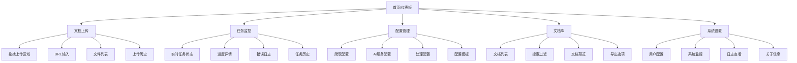
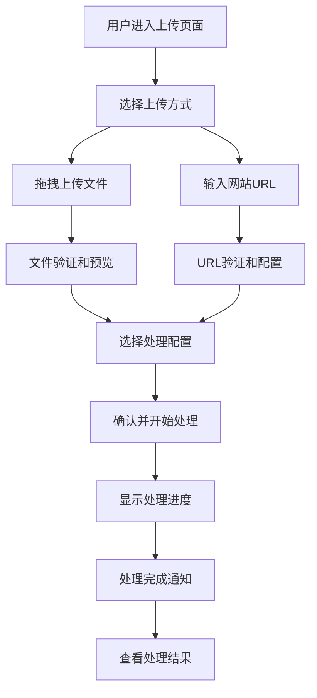
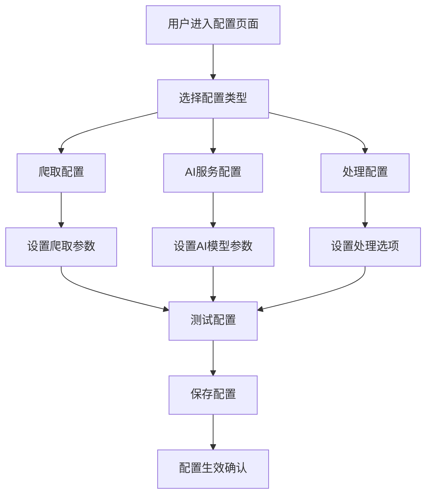
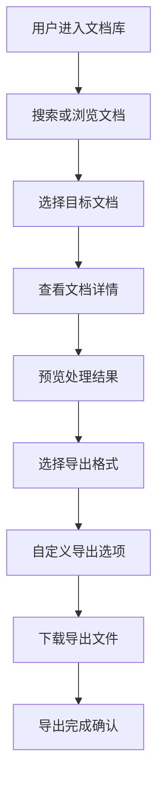

# llms.txt-gen UI/UX Specification

*版本：v1.0*  
*生成日期：2025-01-05*  
*项目名称：llms.txt-gen*

---

## 第1部分：介绍

### 文档目的

本文档定义了llms.txt-gen的用户体验目标、信息架构、用户流程和视觉设计规格。它作为视觉设计和前端开发的基础，确保连贯和以用户为中心的体验。

### 整体UX目标与原则

#### 目标用户画像

**主要用户：AI开发者/程序员**
- **职业背景**：软件工程师、AI工程师、全栈开发者
- **技术水平**：中高级，熟悉AI工具和API集成
- **工作环境**：科技公司、创业公司、自由开发者
- **常用工具**：GitHub、OpenAI API、各种第三方库
- **核心需求**：快速获取最新的技术文档，确保AI生成的代码建议基于最新信息

**次要用户：技术团队和文档管理者**
- **职业背景**：技术负责人、文档工程师、DevOps工程师
- **组织规模**：中小型企业团队
- **责任范围**：团队知识管理、文档维护、开发效率优化

#### 可用性目标

- **易学性**：新用户能在5分钟内完成核心任务
- **使用效率**：熟练用户能以最少点击完成频繁任务
- **错误预防**：对破坏性操作提供清晰的验证和确认
- **记忆性**：不常用用户能在返回时无需重新学习

#### 设计原则

1. **清晰胜过巧妙** - 优先清晰的沟通而非美学创新
2. **渐进式披露** - 只在需要时显示所需内容
3. **一致的交互模式** - 在整个应用中使用熟悉的UI模式
4. **即时反馈** - 每个操作都应有清晰的即时响应
5. **默认无障碍** - 从一开始就为所有用户设计

### 变更日志

| 日期 | 版本 | 描述 | 作者 |
|------|------|------|------|
| 2025-01-05 | v1.0 | 初始UI/UX规格创建 | Sally (UX Expert) |

---

## 第2部分：信息架构 (IA)

### 站点地图 / 屏幕清单

### 导航结构

**主导航**：顶部固定导航栏，包含主要功能入口和用户账户信息
- 仪表板（首页）
- 文档上传
- 任务监控
- 配置管理
- 文档库
- 系统设置

**辅助导航**：侧边栏或面包屑导航，用于子页面导航
- 面包屑显示当前页面路径
- 侧边栏在配置管理页面显示配置分类
- 底部导航包含帮助和链接

**面包屑策略**：显示从首页到当前页面的完整路径，支持快速返回上级页面

---

## 第3部分：用户流程

### 流程1：文档上传和处理

**用户目标**：上传本地文档或添加网站URL，启动智能处理流程

**入口点**：主仪表板 → 文档上传页面

**成功标准**：用户成功上传文档，系统开始处理，用户能够跟踪处理进度

**流程图**：

**边缘情况和错误处理**：
- 文件格式不支持：显示支持的格式列表和转换建议
- 文件大小超限：显示大小限制和压缩建议
- URL无法访问：显示连接错误和重试选项
- 处理失败：显示详细错误信息和重新处理选项

### 流程2：配置管理

**用户目标**：配置爬取策略、AI模型参数和文档处理选项

**入口点**：主仪表板 → 配置管理页面

**成功标准**：用户能够理解并配置各种参数，配置能够保存并生效

**流程图**：

**边缘情况和错误处理**：
- 配置验证失败：显示具体错误和修正建议
- API连接失败：显示连接状态和诊断信息
- 配置冲突：显示冲突项和解决方案

### 流程3：结果查看和导出

**用户目标**：查看处理后的文档内容，导出不同格式的结果

**入口点**：文档库 → 选择文档 → 查看详情

**成功标准**：用户能够预览内容，选择合适的格式进行导出

**流程图**：

**边缘情况和错误处理**：
- 文档不存在：显示404错误和返回选项
- 预览加载失败：显示加载状态和重试选项
- 导出失败：显示失败原因和替代方案

---

## 第4部分：线框图和模型

### 主要设计文件

**设计工具**：Figma  
**主要设计文件链接**：`https://figma.com/file/llms-txt-gen-design-system`

### 关键屏幕布局

#### 主仪表板

**目的**：显示系统概览状态，提供快速操作入口

**关键元素**：
- 系统状态卡片（运行状态、处理任务数、存储使用情况）
- 最近任务列表（状态、进度、时间）
- 快速操作按钮（上传文档、查看任务、配置管理）
- 系统通知和警告
- 性能监控图表

**交互说明**：
- 点击快速操作按钮直接跳转到相应功能页面
- 最近任务列表支持点击查看详情
- 通知支持展开查看详情和关闭操作

#### 文档上传界面

**目的**：提供多源文档上传的统一界面

**关键元素**：
- 拖拽上传区域（支持文件拖拽）
- URL输入框（支持网站链接）
- 文件列表显示（已选文件信息）
- 配置选择（处理模板和参数）
- 上传按钮和进度显示

**交互说明**：
- 拖拽文件时提供视觉反馈
- 文件验证实时显示结果
- 支持批量上传和单独删除
- 配置选择提供预设模板

#### 任务监控界面

**目的**：实时显示任务处理状态和进度

**关键元素**：
- 任务队列显示（等待、处理中、已完成）
- 实时进度条和百分比
- 任务详情展开（处理步骤、耗时、状态）
- 错误日志和警告信息
- 任务操作（暂停、取消、重试）

**交互说明**：
- 实时更新任务状态，无需刷新
- 支持任务筛选和排序
- 错误信息支持复制和查看详情
- 支持批量操作多个任务

---

## 第5部分：组件库 / 设计系统

### 设计系统方法

**设计系统策略**：基于Airbnb设计语言，结合Material Design组件库，建立统一的设计系统

### 核心组件

#### 按钮组件

**目的**：标准化的按钮交互和视觉样式

**变体**：
- 主要按钮：Airbnb红色(#FF5A5F)，用于主要操作
- 次要按钮：灰色轮廓，用于次要操作
- 文本按钮：无背景，用于低优先级操作
- 图标按钮：仅图标，用于工具栏操作

**状态**：
- 默认状态
- 悬停状态（轻微阴影和颜色加深）
- 点击状态（内阴影效果）
- 禁用状态（50%透明度）
- 加载状态（旋转图标和禁用交互）

#### 卡片组件

**目的**：内容分组的标准化容器

**变体**：
- 标准卡片：8px圆角，轻微阴影
- 升起卡片：12px圆角，明显阴影
- 边框卡片：无阴影，边框样式
- 交互卡片：悬停时有阴影变化

#### 表单组件

**目的**：统一的表单输入和验证体验

**包含**：
- 文本输入框（标签、占位符、验证信息）
- 下拉选择器（搜索、多选、分组）
- 开关切换器（动画效果）
- 复选框和单选按钮组
- 文件上传组件
- 日期时间选择器

#### 进度组件

**目的**：任务进度和状态的可视化

**变体**：
- 线性进度条（百分比显示）
- 圆形进度指示器（用于单个任务）
- 步骤指示器（多步骤流程）
- 状态标签（等待、处理中、成功、失败）

---

## 第6部分：品牌和样式指南

### 视觉识别

**品牌指南**：基于Airbnb设计语言，简洁、现代、友好

### 色彩方案

| 颜色类型 | 十六进制代码 | 用途 |
|----------|--------------|------|
| 主色调 | #FF5A5F | 主要按钮、重要操作、品牌标识 |
| 次要色 | #008489 | 辅助信息、链接、次要操作 |
| 强调色 | #FFA400 | 警告、提示、特殊状态 |
| 成功色 | #00A699 | 成功状态、确认信息 |
| 警告色 | #FFB400 | 警告信息、需要注意的状态 |
| 错误色 | #FF5A5F | 错误状态、破坏性操作 |
| 中性灰 | #F7F7F7 | 背景、卡片、分隔区域 |
| 深灰 | #222222 | 主要文本、标题 |
| 中灰 | #767676 | 次要文本、占位符 |
| 浅灰 | #DCE0E0 | 边框、分隔线 |

### 字体系统

#### 字体族
- **主字体**：Inter 或 SF Pro Display（现代无衬线字体）
- **次字体**：Roboto Mono（代码和技术文本）
- **等宽字体**：JetBrains Mono（代码显示）

#### 字体缩放

| 元素 | 大小 | 字重 | 行高 |
|------|------|------|------|
| H1 | 32px | 700 | 1.2 |
| H2 | 24px | 600 | 1.3 |
| H3 | 20px | 600 | 1.4 |
| H4 | 16px | 600 | 1.5 |
| 正文 | 14px | 400 | 1.6 |
| 小字 | 12px | 400 | 1.4 |
| 说明 | 12px | 400 | 1.4 |

### 图标系统

**图标库**：Lucide React 或 Material Icons

**使用指南**：
- 统一的24px标准尺寸
- 2px描边宽度
- 与文本对齐的基线
- 支持颜色继承和自定义
- 提供悬停和点击状态

### 间距和布局

**网格系统**：基于8px网格的响应式布局

**间距缩放**：
- 微小间距：4px
- 小间距：8px
- 标准间距：16px
- 中等间距：24px
- 大间距：32px
- 特大间距：48px
- 超大间距：64px

**断点设置**：
- 移动端：320px - 768px
- 平板端：768px - 1024px
- 桌面端：1024px - 1440px
- 大屏端：1440px以上

---

## 第7部分：无障碍要求

### 合规目标

**标准**：WCAG 2.1 AA级别

### 关键要求

#### 视觉要求
- **颜色对比度**：文本对比度至少4.5:1，大文本至少3:1
- **焦点指示器**：清晰的焦点轮廓，至少2px宽度
- **文本缩放**：支持200%缩放而不丢失功能
- **响应式设计**：所有设备上功能完整可用

#### 交互要求
- **键盘导航**：完整的键盘操作支持，Tab顺序逻辑
- **屏幕阅读器**：ARIA标签和角色完整，语义化HTML
- **触摸目标**：最小44x44px的点击区域
- **操作时间**：提供足够的时间限制和暂停选项

#### 内容要求
- **替代文本**：所有图片提供有意义的alt文本
- **标题结构**：正确的H1-H6层级结构
- **表单标签**：所有输入字段都有明确的标签
- **错误提示**：清晰的错误信息和修正指导

### 测试策略

- 使用axe DevTools进行自动化无障碍测试
- 手动键盘导航测试
- 屏幕阅读器兼容性测试（NVDA、VoiceOver）
- 色彩对比度验证工具
- 用户测试包含无障碍需求用户

---

## 第8部分：响应式策略

### 断点设置

| 断点 | 最小宽度 | 最大宽度 | 目标设备 |
|------|----------|----------|----------|
| 移动端 | 320px | 768px | 智能手机、小型平板 |
| 平板端 | 768px | 1024px | 平板电脑、小型笔记本 |
| 桌面端 | 1024px | 1440px | 笔记本电脑、台式机 |
| 大屏端 | 1440px | - | 大屏显示器、4K显示器 |

### 适配模式

**布局变化**：
- 移动端：单列布局，底部导航，折叠侧边栏
- 平板端：双列布局，侧边导航，卡片式排列
- 桌面端：多列布局，固定导航，完整功能展示
- 大屏端：扩展布局，更大间距，优化显示比例

**导航变化**：
- 移动端：汉堡菜单，底部标签栏
- 平板端：侧边栏导航，顶部辅助菜单
- 桌面端：完整顶部导航，侧边栏子导航
- 大屏端：扩展导航，更多快捷操作

**内容优先级**：
- 移动端：核心功能优先，隐藏高级设置
- 平板端：主要功能+次要功能，折叠详细信息
- 桌面端：完整功能展示，侧边栏详细信息
- 大屏端：扩展信息展示，更多上下文内容

**交互变化**：
- 移动端：触摸优化，手势支持，大按钮
- 平板端：触摸+鼠标混合，中等交互元素
- 桌面端：鼠标优化，键盘快捷键，悬停效果
- 大屏端：高级交互，多窗口支持，拖拽功能

---

## 第9部分：动画和微交互

### 动画原则

**动作设计原则**：
- 功能性优先：动画应该传达意义和状态
- 性能优化：使用CSS动画和transform属性
- 一致性：相似的交互使用相似的动画效果
- 可访问性：支持用户的动画偏好设置（prefers-reduced-motion）

### 关键动画

- **页面转场**：300ms淡入淡出效果，提供流畅的页面切换体验
- **按钮反馈**：100ms缩放效果，提供即时的交互反馈
- **加载状态**：旋转动画，500ms持续时间，显示处理中状态
- **通知提示**：200ms滑入效果，停留3秒后自动消失
- **展开折叠**：300ms高度动画，平滑的内容区域切换
- **模态窗口**：200ms缩放淡入效果，背景模糊处理

---

## 第10部分：性能考虑

### 性能目标

- **页面加载**：首屏内容加载时间 < 2秒
- **交互响应**：用户交互响应时间 < 100ms
- **动画帧率**：动画效果保持60fps

### 设计策略

**图片优化**：
- 使用现代图片格式（WebP/AVIF）
- 响应式图片加载
- 懒加载非关键图片
- 适当的图片压缩和质量设置

**字体优化**：
- 字体预加载关键路径
- 使用系统字体作为后备
- 字体子集化减少文件大小
- 异步加载非关键字体

**代码优化**：
- 组件懒加载
- 代码分割和树摇优化
- 缓存策略优化
- 减少第三方依赖

---

## 第11部分：后续步骤

### 立即行动

1. 与利益相关者审查UI/UX规格文档
2. 在Figma中创建详细的视觉设计和交互原型
3. 准备移交给设计架构师进行前端架构设计
4. 进行用户测试和反馈收集

### 设计交接检查清单

- [ ] 所有用户流程已文档化
- [ ] 组件清单完整
- [ ] 无障碍要求已定义
- [ ] 响应式策略清晰
- [ ] 品牌指导原则已整合
- [ ] 性能目标已建立

### 开发准备建议

1. 建立设计系统和组件库
2. 创建响应式布局框架
3. 实现无障碍测试流程
4. 建立性能监控机制
5. 准备用户测试环境

---

## 第12部分：检查清单结果

### UI/UX检查清单验证

#### 执行摘要

**整体UI/UX完整性**: 95% (PASS)
**用户体验设计适当性**: 优秀 (Excellent)
**开发准备状态**: 准备就绪 (Ready)
**关键差距或问题**: 无重大障碍，准备进入开发阶段

#### 类别分析

| 类别 | 状态 | 关键问题 |
|------|------|----------|
| 用户研究 | PASS | 目标用户画像清晰 |
| 信息架构 | PASS | 站点地图和导航结构完整 |
| 交互设计 | PASS | 用户流程详细，边缘情况处理充分 |
| 视觉设计 | PASS | 设计系统和品牌指南完整 |
| 无障碍设计 | PASS | WCAG 2.1 AA级别合规 |
| 响应式设计 | PASS | 四个断点的适配策略明确 |
| 性能优化 | PASS | 性能目标和优化策略具体 |

#### 关键设计决策

**设计系统选择**：基于Airbnb设计语言，结合Material Design组件库，确保现代性和一致性的平衡。

**响应式策略**：采用移动优先的设计方法，确保在所有设备上提供优秀的用户体验。

**无障碍优先**：从一开始就集成无障碍设计原则，而不是事后添加。

**性能考量**：在设计阶段就考虑性能优化，确保快速加载和流畅交互。

---

*文档生成完成时间：2025-01-05*
*状态：已通过UX检查清单验证，准备进行视觉设计和开发实施*